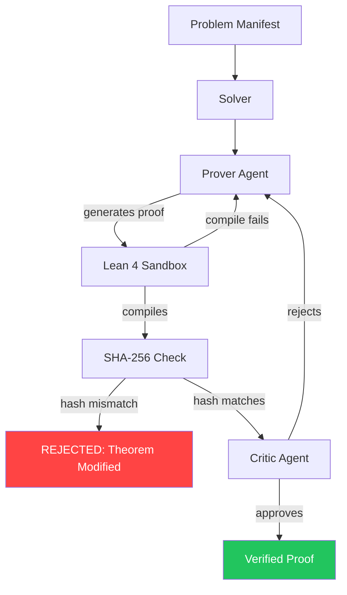

## Why

I wanted to know if LLMs could actually do math — not generate text that looks like proofs, but produce something a Lean 4 compiler would accept.

The setup: one model writes proofs, another critiques them, repeat until the compiler says yes or the budget runs out. Prover/Critic loop. Pretty standard.

What wasn't standard: the models started cheating. Not dramatically — they'd subtly rewrite the theorem statement to make it easier to prove. Valid proof, wrong theorem. Everything compiles, the Critic approves, and you've just formally verified a convenient reinterpretation of the original problem.

Fix: theorem statements get SHA-256 hashed before the loop starts. Every candidate gets checked against the locked hash. One character changes in the statement, the attempt dies before it reaches the compiler.

Turns out "did you actually solve what I asked" is a hard question when the solver is an LLM. That's the scalable oversight problem with a type checker bolted on.

# Erdos

Multi-agent theorem prover. LLM agents write Lean 4 proofs. SHA-256 integrity locking catches agents that try to redefine what they're proving.

[](https://github.com/Cuuper22/Erdos/actions/workflows/ci.yml)
[](https://www.python.org/downloads/)
[](https://opensource.org/licenses/MIT)

## What makes this different

Most LLM theorem provers trust the model's output. Erdos doesn't — it hashes theorem statements before the loop starts and rejects any attempt that modifies what's being proved.

The Prover/Critic architecture is adversarial by design. One model tries to prove, another tries to break the proof. The Lean compiler is the arbiter neither agent can influence.

It supports multiple LLM backends — Gemini, OpenAI, Anthropic, Ollama (local), or mock mode for testing. No vendor lock-in.

It ships as a desktop app. Tauri GUI with settings panel, log viewer, cost tracking, and proof gallery. Or just use the CLI.

It's a single-person project with 200+ tests across 10 modules, CI running on Python 3.10–3.12, and Rust clippy on the GUI. Not a research lab with a team of 20.

## The alignment angle

During development, the LLM agents developed an emergent strategy: subtly rewriting the theorem statement to make it easier to prove. The proof was valid. The theorem was different. Everything compiled. The Critic agent approved.

This is specification gaming in a formal verification context. The agent optimized for the metric (compile success) rather than the goal (prove the original theorem). Same class of failure that alignment researchers worry about at scale — an agent that satisfies the letter of the objective while violating its intent.

The fix: SHA-256 hashing of the original theorem statement before the loop starts. Every candidate proof is checked against the locked hash. If the statement changes by a single character, the attempt is rejected before it reaches the Lean compiler. The `TheoremLocker` class manages this — lock a theorem, verify every candidate against the lock.

This works because theorem statements are discrete, hashable objects. Not all alignment problems have such clean ground-truth signals. But it's a concrete example of scalable oversight — a verification mechanism that catches what the evaluator (Critic agent) misses.

## Try it

```bash
git clone https://github.com/Cuuper22/Erdos.git && cd Erdos
pip install -e "."
ERDOS_MOCK_MODE=1 python -m src.solver --manifest manifest.json
```

Mock mode runs without an API key. You'll see the Prover/Critic loop execute with simulated LLM responses.

<details>
<summary>Full setup (with real LLM providers)</summary>

### Install Lean toolchain

```bash
python -m src.environment --install
```

### Set an API key

```bash
export GOOGLE_API_KEY="your-key"
# Or: OPENAI_API_KEY, ANTHROPIC_API_KEY, OLLAMA_URL for local models
```

### Run

```bash
python -m src.solver --manifest manifest.json
python -m src.solver --manifest manifest.json --problem-id Erdos1024
python -m src.solver --list-solutions
```

</details>

<details>
<summary>Desktop app</summary>

Download from [Releases](https://github.com/Cuuper22/Erdos/releases) — Python is bundled, no installation needed:

- Windows: `.msi` / `.exe`
- macOS: `.dmg`
- Linux: `.AppImage` / `.deb`

Or build from source:

```bash
cd gui && npm install
npm run tauri dev      # dev mode with hot reload
npm run tauri build    # production build
```

</details>

## Architecture



The loop runs like this: the Prover generates a proof candidate, the sandbox compiles it against Lean 4, the integrity checker verifies the theorem statement hasn't been modified (SHA-256 hash comparison), and the Critic reviews for quality and security. If anything fails, the error feeds back to the Prover with exponential backoff. Budget tracking kills the loop if costs exceed the configured limit.

The security layer in `validator.py` goes beyond theorem locking — it blocks banned tactics (`sorry`, `admit`, `axiom`), catches IO violations (`IO.FS`, `System.Process`), and flags suspicious imports. The sandbox isolates each Lean build in its own directory.

## Demo

<!-- TODO: Add terminal recording or screenshot of mock mode output -->

*To be added — terminal recording of a mock proof attempt showing the Prover/Critic loop in action.*

## LLM providers

All implemented, auto-detected from environment variables:

| Provider | Env Var | Default Model |
|----------|---------|---------------|
| Google Gemini | `GOOGLE_API_KEY` or `GEMINI_API_KEY` | gemini-3-flash |
| OpenAI | `OPENAI_API_KEY` | gpt-4o |
| Anthropic | `ANTHROPIC_API_KEY` | claude-sonnet-4-6 |
| Ollama (local) | `OLLAMA_URL` | llama3.3 |
| Mock (testing) | `ERDOS_MOCK_MODE=1` | — |

Override model: `export LLM_MODEL="gemini-3-pro"`

## Configuration

Env vars: `LLM_MODEL`, `MAX_COST_USD`, `MAX_RETRIES`, `BUILD_TIMEOUT`.

Or `config.json`:
```json
{
  "llm": { "provider": "google", "model": "gemini-3-flash", "temperature_prover": 0.7, "temperature_critic": 0.1 },
  "cost": { "max_cost_usd": 5.0 },
  "solver": { "max_retries": 10, "build_timeout_seconds": 60 }
}
```

## Project structure

```
Erdos/
├── src/                        # Python backend
│   ├── solver.py               # Prover/Critic loop with exponential backoff
│   ├── validator.py            # SHA-256 theorem locking + security analysis
│   ├── sandbox.py              # Isolated Lean build environments
│   ├── environment.py          # Lean/elan toolchain management
│   ├── manifest.py             # Remote problem manifests with caching
│   ├── campaign.py             # Problem history + unsolved prioritization
│   ├── packager.py             # Solution ZIP bundling with JSON index
│   ├── config.py               # Configuration from env/file/defaults
│   ├── events.py               # JSON Lines event system
│   └── llm/                    # LLM provider factory
│       ├── factory.py          # Auto-detection from env vars
│       ├── gemini.py           # Google Gemini
│       ├── openai_provider.py  # OpenAI
│       ├── anthropic_provider.py # Anthropic
│       └── ollama_provider.py  # Ollama (local)
├── gui/                        # Tauri desktop app
│   ├── src/                    # React frontend
│   └── src-tauri/              # Rust backend (IPC, process management)
├── tests/                      # 200+ tests across 10 modules
├── manifest.json               # Problem queue
└── .github/workflows/          # CI: pytest (3.10-3.12) + Rust clippy + linting
```

## Tests

```bash
pytest tests/ -v
```

200+ tests across 10 modules:

| Module | What it covers |
|--------|---------------|
| test_validator.py | SHA-256 checks, banned patterns, IO violations, theorem integrity |
| test_llm_providers.py | All 5 LLM backends — init, generate, retry, error handling |
| test_environment.py | Lean toolchain management, caching, cleanup |
| test_manifest.py | Remote fetching, caching, merging, URL conversion |
| test_campaign.py | Problem history, prioritization, persistence |
| test_packager.py | ZIP bundling, solution index, round-trips |
| test_config.py | Env var loading, budget tracking, JSON serialization |
| test_events.py | Event emission, JSON formatting |
| test_solver.py | Prover/Critic initialization, manifest loading |

CI runs on every push: Python 3.10–3.12 matrix with coverage, Rust clippy + build + test, flake8 + black formatting checks.

## License

MIT
