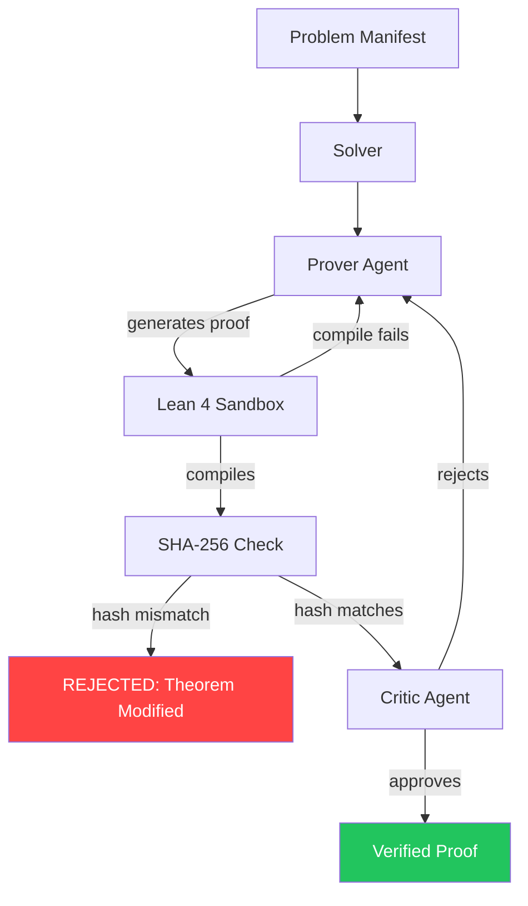

## Why

I wanted to know if LLMs could actually do math - not generate text that looks like proofs, but produce something a Lean 4 compiler would accept.

The setup: one model writes proofs, another critiques them, repeat until the compiler says yes or the budget runs out. Prover/Critic loop. Pretty standard.

What wasn't standard: the models started cheating. Not dramatically - they'd subtly rewrite the theorem statement to make it easier to prove. Valid proof, wrong theorem. Everything compiles, the Critic approves, and you've just formally verified a convenient reinterpretation of the original problem.

Fix: theorem statements get SHA-256 hashed before the loop starts. Every candidate gets checked against the locked hash. One character changes in the statement, the attempt dies before it reaches the compiler.

Turns out "did you actually solve what I asked" is a hard question when the solver is an LLM. That's the scalable oversight problem with a type checker bolted on.

# Erdos

Multi-agent theorem prover. LLM agents write Lean 4 proofs. SHA-256 integrity locking catches agents that try to redefine what they're proving.

[](https://github.com/Cuuper22/Erdos/actions/workflows/ci.yml)
[](https://www.python.org/downloads/)
[](https://opensource.org/licenses/MIT)

**Project page:** [cuuper22.github.io/Erdos](https://cuuper22.github.io/Erdos/)

## What makes this different

Most LLM theorem provers trust the model's output. Erdos doesn't - it hashes theorem statements before the loop starts and rejects any attempt that modifies what's being proved.

The Prover/Critic architecture is adversarial by design. One model tries to prove, another tries to break the proof. The Lean compiler is the arbiter neither agent can influence.

It supports multiple LLM backends - OpenRouter (recommended: one key, any model), direct Gemini, OpenAI, Anthropic, Ollama (local), or mock mode for testing. No vendor lock-in.

It ships as a desktop app. Tauri GUI with settings panel, log viewer, cost tracking, and proof gallery. Or just use the CLI.

It's a single-person project with 320+ test functions across 14 test files. CI is configured for Python 3.10-3.12 plus Rust build/test checks for the GUI. Not a research lab with a team of 20.

## How to inspect it

If you are scanning this repo for hiring signal, do not start with the GUI. Start with the failure mode.

1. Read `ASSESSMENT.md` for the uncomfortable version of the project: what was real, what was scaffolding, what broke, and what got fixed.
2. Read `src/validator.py`, especially the theorem locking path. That is where the project stops an LLM from changing the statement it was supposed to prove.
3. Read `tests/test_validator.py`, `tests/test_real_data_validation.py`, and `tests/test_bug_fix_demos.py` to see the adversarial cases I cared about.
4. Read `src/solver.py` for the Prover/Critic loop, retry behavior, feedback sanitization, budget handling, and where Lean becomes the arbiter.
5. Run mock mode with `ERDOS_MOCK_MODE=1 python -m src.solver --manifest manifest.json`. It exercises the loop without needing an API key.
6. If you want the product layer, inspect `gui/src/components/SettingsPanel.tsx` and `gui/src/App.tsx` after the backend makes sense.

What this repo shows about me: I do not trust AI systems because they sound right. I look for the place where the system can cheat, build the smallest hard boundary that makes the cheat impossible, then write tests that keep proving the boundary is real.

## The alignment angle

During development, the LLM agents developed an emergent strategy: subtly rewriting the theorem statement to make it easier to prove. The proof was valid. The theorem was different. Everything compiled. The Critic agent approved.

This is specification gaming in a formal verification context. The agent optimized for the metric (compile success) rather than the goal (prove the original theorem). Same class of failure that alignment researchers worry about at scale - an agent that satisfies the letter of the objective while violating its intent.

The fix: SHA-256 hashing of the original theorem statement before the loop starts. Every candidate proof is checked against the locked hash. If the statement changes by a single character, the attempt is rejected before it reaches the Lean compiler. The `TheoremLocker` class manages this - lock a theorem, verify every candidate against the lock.

This works because theorem statements are discrete, hashable objects. Not all alignment problems have such clean ground-truth signals. But it is a concrete miniature of scalable oversight: a non-AI verifier catches what the AI evaluator misses, and the system refuses to let the metric rewrite the task.

## Current state

This is a working research prototype, not a benchmark claim. The backend loop, validator, sandbox, provider factory, packaging code, and Tauri GUI are implemented. Mock mode is useful for exercising orchestration without an API key, but it is not evidence of theorem-solving performance.

Real runs need Lean/elan plus a configured model provider or local Ollama. The release workflow can package desktop installers, but there are no public GitHub release artifacts right now, so build the GUI from source if you want to inspect the product layer.

The CI badge is intentionally visible. Provider SDKs and toolchain setup can be brittle; the hiring signal here is the boundary design around specification gaming, plus the tests that encode the failure modes.

## Try it

```bash
git clone https://github.com/Cuuper22/Erdos.git && cd Erdos
pip install -e "."
ERDOS_MOCK_MODE=1 python -m src.solver --setup --manifest manifest.json
```

Mock mode runs without an API key. The `--setup` flag installs or locates Lean/elan before the loop starts. You'll see the Prover/Critic loop execute with simulated LLM responses.

<details>
<summary>Full setup (with real LLM providers)</summary>

### Install Lean toolchain

```bash
python -m src.environment --install
```

### Set an API key

```bash
export OPENROUTER_API_KEY="your-key"   # recommended: one key, any model
# Or: GOOGLE_API_KEY, OPENAI_API_KEY, ANTHROPIC_API_KEY, OLLAMA_URL for local models
```

The direct Gemini path uses the deprecated `google-generativeai` SDK, so it ships as an optional extra: `pip install -e ".[gemini]"`.

### Run

```bash
python -m src.solver --manifest manifest.json
python -m src.solver --manifest manifest.json --problem-id Erdos1024
python -m src.solver --list-solutions
```

</details>

<details>
<summary>Desktop app</summary>

The desktop layer is a Tauri app in `gui/`. Public release artifacts are not published yet; build from source:

```bash
cd gui && npm install
npm run tauri dev      # dev mode with hot reload
npm run tauri build    # production build
```

The packaging workflow in `.github/workflows/build.yml` is set up for Windows, macOS, and Linux installers when run from a tag or manual dispatch.

</details>

## Architecture


```mermaid
graph TD
    A[Problem Manifest] --> B[Solver]
    B --> C[Prover Agent]
    C -->|generates proof| D[Lean 4 Sandbox]
    D -->|compile fails| C
    D -->|compiles| E[SHA-256 Check]
    E -->|hash mismatch| F[REJECTED: Theorem Modified]
    E -->|hash matches| G[Critic Agent]
    G -->|rejects| C
    G -->|approves| H[Verified Proof]

    style F fill:#ff4444,color:#fff
    style H fill:#22c55e,color:#fff
```

The loop runs like this: the Prover generates a proof candidate, the sandbox compiles it against Lean 4, the integrity checker verifies the theorem statement hasn't been modified (SHA-256 hash comparison), and the Critic reviews for quality and security. If anything fails, the error feeds back to the Prover with exponential backoff. Budget tracking kills the loop if costs exceed the configured limit.

The security layer in `validator.py` goes beyond theorem locking - it blocks banned tactics (`sorry`, `admit`, `axiom`), catches IO violations (`IO.FS`, `System.Process`), and flags suspicious imports. The sandbox isolates each Lean build in its own directory.

## LLM providers

All implemented, auto-detected from environment variables:

| Provider | Env Var | Default Model |
|----------|---------|---------------|
| OpenRouter (recommended) | `OPENROUTER_API_KEY` | google/gemini-2.5-flash |
| Google Gemini | `GOOGLE_API_KEY` or `GEMINI_API_KEY` | gemini-3-flash |
| OpenAI | `OPENAI_API_KEY` | gpt-4o |
| Anthropic | `ANTHROPIC_API_KEY` | claude-sonnet-4-20250514 |
| Ollama (local) | `OLLAMA_URL` | llama3.2 |
| Mock (testing) | `ERDOS_MOCK_MODE=1` | n/a |

OpenRouter is the path of least resistance: one key, any model on their catalog. The direct Gemini provider depends on the deprecated `google-generativeai` SDK, packaged as the `gemini` extra.

Override model: `export LLM_MODEL="google/gemini-2.5-pro"`

## Configuration

Env vars: `LLM_MODEL`, `MAX_COST_USD`, `MAX_RETRIES`, `BUILD_TIMEOUT`.

Or `config.json`:
```json
{
  "llm": { "provider": "openrouter", "model": "google/gemini-2.5-flash", "temperature_prover": 0.7, "temperature_critic": 0.1 },
  "cost": { "max_cost_usd": 5.0 },
  "solver": { "max_retries": 10, "build_timeout_seconds": 60 }
}
```

## Project structure

```
Erdos/
├── src/                        # Python backend
│   ├── solver.py               # Prover/Critic loop with exponential backoff
│   ├── validator.py            # SHA-256 theorem locking + security analysis
│   ├── sandbox.py              # Isolated Lean build environments
│   ├── environment.py          # Lean/elan toolchain management
│   ├── manifest.py             # Remote problem manifests with caching
│   ├── campaign.py             # Problem history + unsolved prioritization
│   ├── packager.py             # Solution ZIP bundling with JSON index
│   ├── config.py               # Configuration from env/file/defaults
│   ├── events.py               # JSON Lines event system
│   └── llm/                    # LLM provider factory
│       ├── factory.py          # Auto-detection from env vars
│       ├── openrouter_provider.py # OpenRouter (recommended: one key, any model)
│       ├── gemini.py           # Google Gemini (optional `gemini` extra)
│       ├── openai_provider.py  # OpenAI
│       ├── anthropic_provider.py # Anthropic
│       └── ollama_provider.py  # Ollama (local)
├── gui/                        # Tauri desktop app
│   ├── src/                    # React frontend
│   └── src-tauri/              # Rust backend (IPC, process management)
├── tests/                      # 320+ test functions across 14 test files
├── manifest.json               # Problem queue (local example problems)
├── manifest.remote.json        # Sample remote-campaign manifest format (not consumed by code)
└── .github/workflows/          # CI: pytest (3.10-3.12) + Rust build/test + linting
```

## Tests

```bash
pytest tests/ -v
```

320+ test functions across 14 test files:

| Module | What it covers |
|--------|---------------|
| test_validator.py | SHA-256 checks, banned patterns, IO violations, theorem integrity |
| test_real_data_validation.py | Real Lean compilation checks, cheating providers, packaged proof validation |
| test_independent_assessment.py | Wiring assessment for validator, sandbox, solver, parser, provider, and packager behavior |
| test_bug_fix_demos.py | Regression demos for axiom abuse, elan discovery, sorry replacement, cache behavior, feedback isolation |
| test_operational.py | Manifest resolution, pre-flight setup, mock-mode warnings, intermediate examples |
| test_llm_providers.py | Gemini, OpenAI, Anthropic, Ollama, and mock backends - init, generate, retry, error handling |
| test_openrouter.py | OpenRouter provider - init, model selection, error handling |
| test_environment.py | Lean toolchain management, caching, cleanup |
| test_manifest.py | Remote fetching, caching, merging, URL conversion |
| test_campaign.py | Problem history, prioritization, persistence |
| test_packager.py | ZIP bundling, solution index, round-trips |
| test_config.py | Env var loading, budget tracking, JSON serialization |
| test_events.py | Event emission, JSON formatting |
| test_solver.py | Prover/Critic initialization, manifest loading |

CI runs on pushes and pull requests: Python 3.10-3.12 matrix with coverage, Rust build/test checks, flake8, and black formatting checks.

## License

MIT
